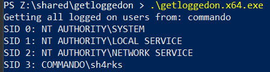

# getloggedonBOF
Gets logged on users on a remote machine using remote registry enumeration.

---

## Explanation
This BOF is a proof of concept from the sources linked underneath. It will parse a remote registry key for its subkeys which a normal user has access to.
The remote registry has certain SIDs listed of logged in users, it will use the local LSA the convert from SID to samaccountname.



## Compilation

Using the makefile with mingw64 on linux device is the easiest:

```c
# make the bofs, can be executed using any coff loader
make

# make test binaries, can be executed as standalone binaries
make test
```

## BOF

Usage in Cobalt strike, using the CNA script

```c
getloggedon <OPT:hostname>
```

## Sources

- [Python Gist](https://gist.github.com/GeisericII/6849bc86620c7a764d88502df5187bd0)
- [Twitter thread](https://twitter.com/Geiseric4/status/1719764121111908510)
